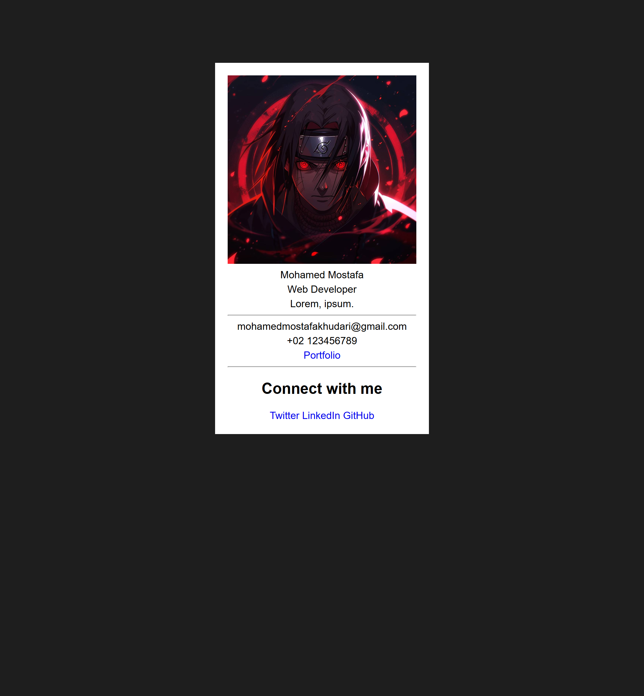

# Business Card

A simple business card built as part of the [freeCodeCamp Certified Full Stack Developer Curriculum](https://www.freecodecamp.org/learn/full-stack-developer/).

## Preview

## Technologies Used

- HTML
- CSS

## Objective

- Introduction to CSS and linking external stylesheet.

## Which curriculum it's part of

freeCodeCamp - CSS

## Any notes or reflections

## Status

✅ Completed

## Credits

- Profile Image created by [Katimur94](https://www.deviantart.com/katimur94/gallery) on [deviantart](https://www.deviantart.com/)
