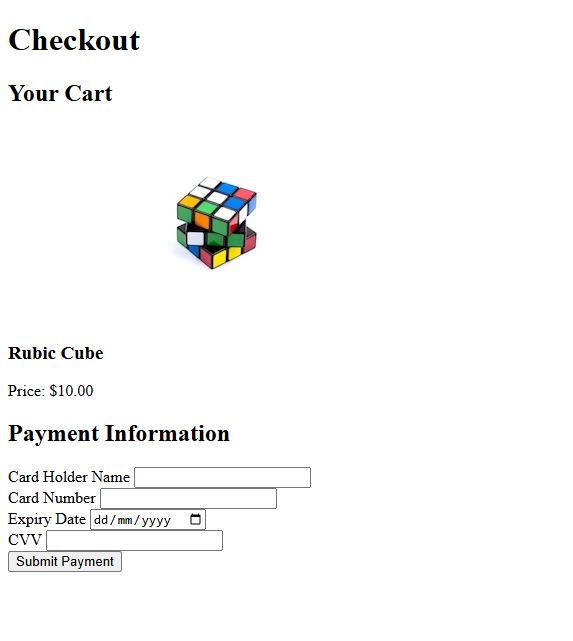

# Checkout Page

A simple checkout page with a place order form built as part of the [freeCodeCamp Certified Full Stack Developer Curriculum](https://www.freecodecamp.org/learn/full-stack-developer/).

## Preview

## Technologies Used

- HTML

## Objective

- some accessibility applications like
  - image alt attribute
  - aria-required ARIA property/attribute for required input fields

## Which curriculum it's part of

freeCodeCamp - HTML

## Any notes or reflections

## Status

✅ Completed
