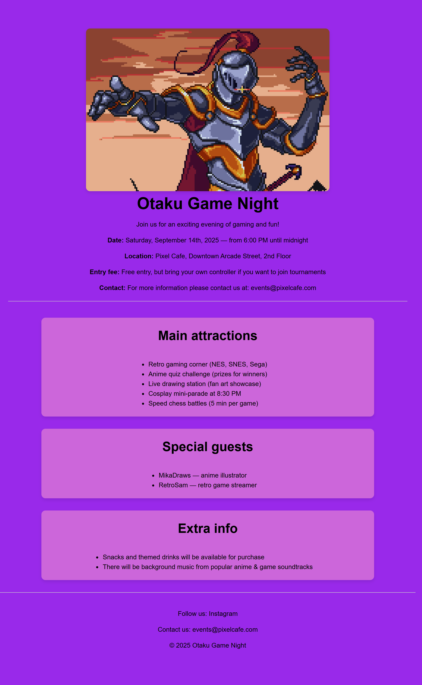

# Event Flyer Page

A simple event flyer page built as part of the [freeCodeCamp Certified Full Stack Developer Curriculum](https://www.freecodecamp.org/learn/full-stack-developer/).

## Preview

## Technologies Used

- HTML
- CSS

## Objective

- Practice aligning elements using absolute and relative CSS units.

## Which curriculum it's part of

freeCodeCamp - CSS

## Any notes or reflections

## Status

✅ Completed
