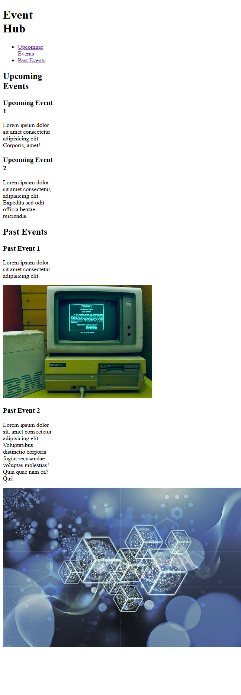

# Event Hub

This is a simple Event hub that acts as tool to organize a group of events in an upcoming/past style, and this is built as part of the [freeCodeCamp Certified Full Stack Developer Curriculum](https://www.freecodecamp.org/learn/full-stack-developer/).

## Preview

## Technologies Used

- HTML

## Objective

- The objective here is to see how an anchor element could be used to link to document fragments (sections for example) in the same page using the id attribute.
- Also it demonstrates the use of semantic HTML (header, nav, main, section, article)

## Which curriculum it's part of

freeCodeCamp - HTML

## Any notes or reflections

## Status

✅ Completed
