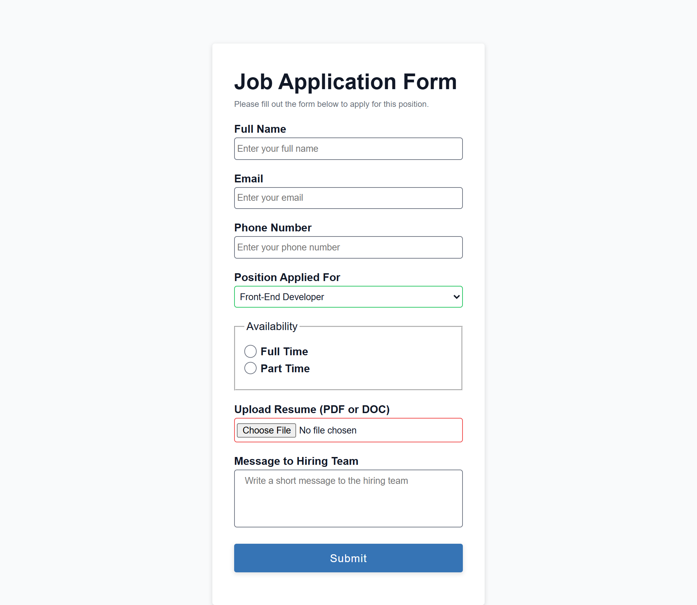

# Job Application Form

A simple job application form built as part of the [freeCodeCamp Certified Full Stack Developer Curriculum](https://www.freecodecamp.org/learn/full-stack-developer/).

## Preview

## Technologies Used

- HTML
- CSS

## Objective

- Practice concepts like :hover, :active, :focus, and the other pseudo-classes related to form controls and input fields.
- Practice CSS variables.
- Implement a custom styling for the radio type input field

## Which curriculum it's part of

freeCodeCamp - CSS

## Any notes or reflections

## Status

✅ Completed
