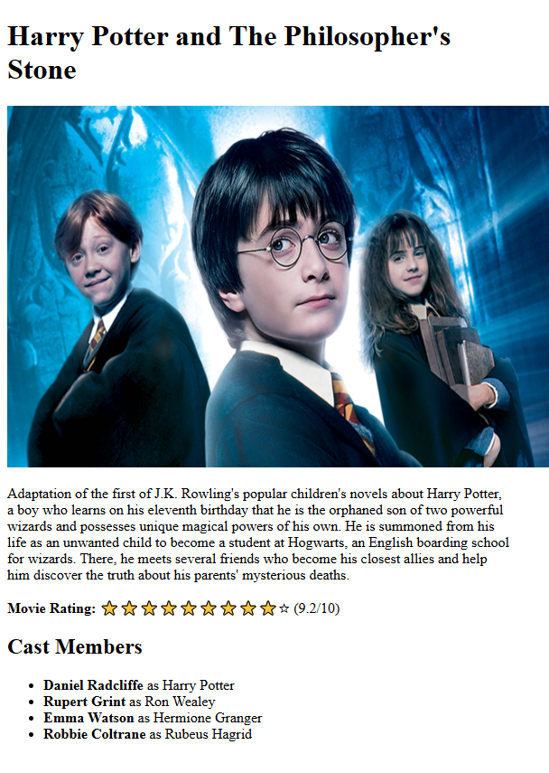

# Movie Review Page

A simple movie review page built as part of the [freeCodeCamp Certified Full Stack Developer Curriculum](https://www.freecodecamp.org/learn/full-stack-developer/).

## Preview

## Technologies Used

- HTML

## Objective

- applying some common accessibility practices
  - image alt attribute
  - aria-hidden attribute to hide decorative elements from the accessibility tree
  - accessible lists with the use of strong element to indicate the significance of the enclosed text to browsers, assistive technologies, and search engines

## Which curriculum it's part of

freeCodeCamp - HTML

## Any notes or reflections

## Status

✅ Completed
