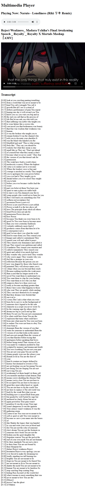

# Multimedia Player

A simple multimedia player that supports audio and video files built as part of the [freeCodeCamp Certified Full Stack Developer Curriculum](https://www.freecodecamp.org/learn/full-stack-developer/).

## Preview

## Technologies Used

- HTML

## Objective

- practice working with video and audio elements
  - how to use them and their attributes
  - how to add tracks to them (captions/subtitles ..etc)
  - how to make them accessible (Ex: aria-label)

## Which curriculum it's part of

freeCodeCamp - HTML

## Any notes or reflections

- One day I want to create a program that convert a video speech to .vtt caption file that can be used as a track with the video element.

## Status

✅ Completed
