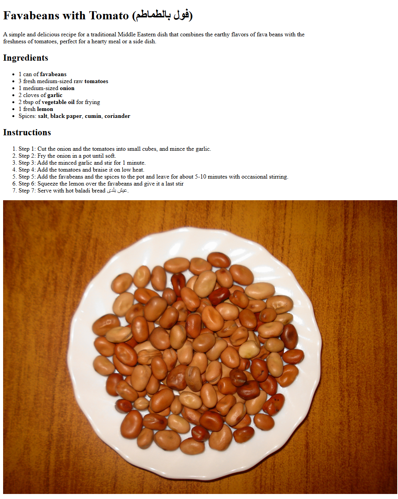

# Recipe Page

This is a simple static page built as part of the [freeCodeCamp Certified Full Stack Developer Curriculum](https://www.freecodecamp.org/learn/full-stack-developer/).

## Preview

## Technologies Used

- HTML

## Objective

Demonstrate the basics of HTML structuring.

## Which curriculum it's part of

freeCodeCamp - HTML

## What you practiced

the basic HTML page structuring

## Any notes or reflections

## Status

✅ Completed
