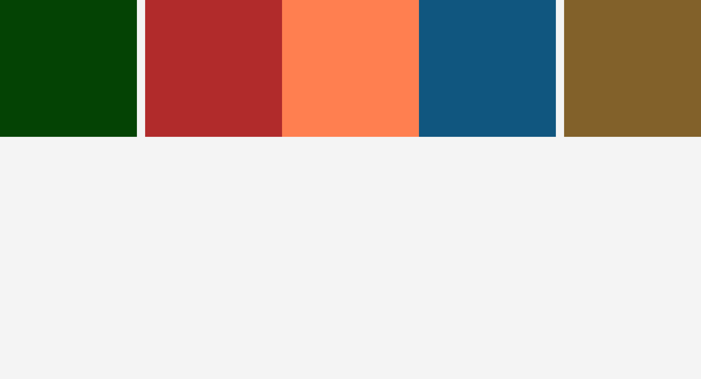

# A Set of Colored Boxes

A simple colored box grid card built as part of the [freeCodeCamp Certified Full Stack Developer Curriculum](https://www.freecodecamp.org/learn/full-stack-developer/).

## Preview

## Technologies Used

- HTML
- CSS

## Objective

- Practice adding background colors to the grid items using hex codes, RGB, and predefined color names.

## Which curriculum it's part of

freeCodeCamp - CSS

## Any notes or reflections

## Status

✅ Completed
