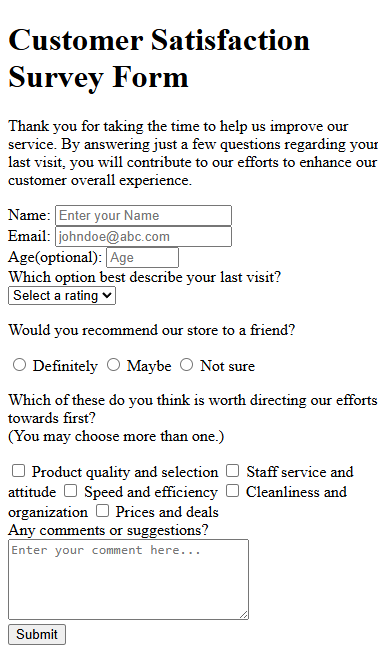

# Survey Form

A simple survey form to collect some useful data for a store about customers experience and overall satisfaction, and this is built as part of the [freeCodeCamp Certified Full Stack Developer Curriculum](https://www.freecodecamp.org/learn/full-stack-developer/).

## Preview

## Technologies Used

- HTML

## Objective

- Explore the basics of HTML forms and the most common input elements.

## Which curriculum it's part of

freeCodeCamp - HTML

## Any notes or reflections

## Status

✅ Completed
