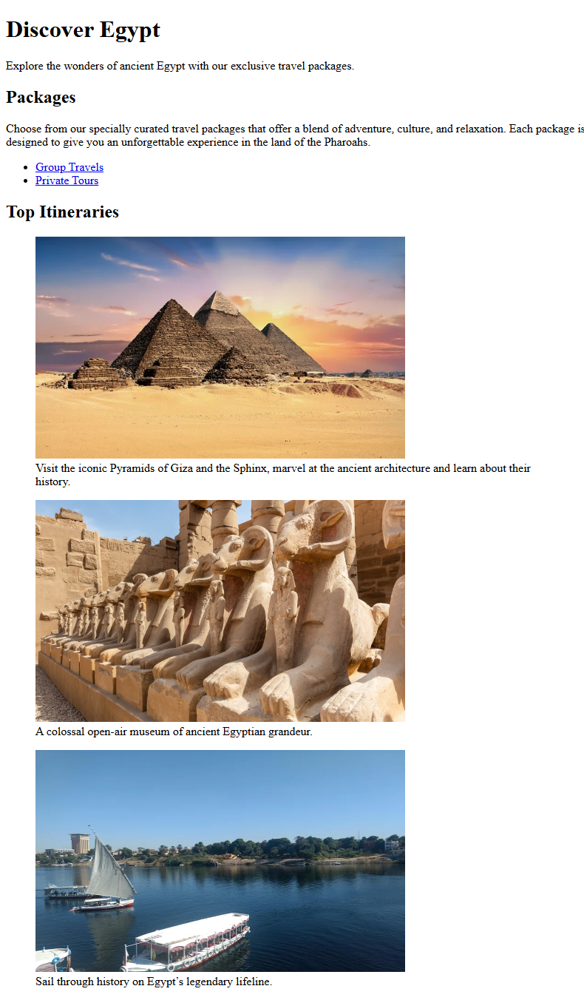

# Travel Page

This is another simple static page built as part of the [freeCodeCamp Certified Full Stack Developer Curriculum](https://www.freecodecamp.org/learn/full-stack-developer/).

## Preview

## Technologies Used

- HTML

## Objective

Continue the basics of HTML structuring and present the usage of figure and figcaption HTML elements
and how image elements can be treated as anchors.

## Which curriculum it's part of

freeCodeCamp - HTML

## What you practiced

the basic HTML page structuring

## Any notes or refelctions

## Status

✅ Completed
