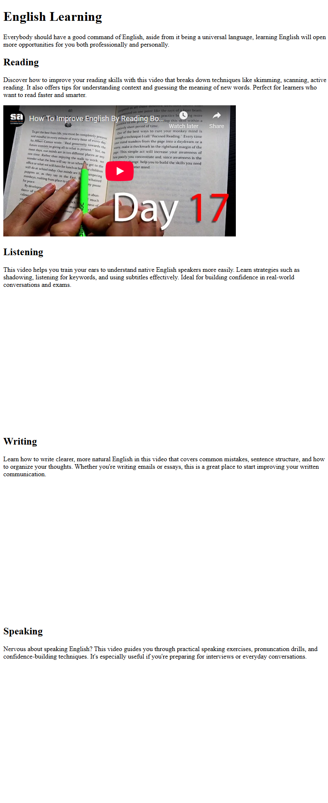

# Video Compilation Page

This is a simple video compilation page, compiling videos related to learning English, and is built as part of the [freeCodeCamp Certified Full Stack Developer Curriculum](https://www.freecodecamp.org/learn/full-stack-developer/).

## Preview

## Technologies Used

- HTML

## Objective

Practice the idea of embedding external resources (like youtube videos) in your web page using iframe HTML element.

## Which curriculum it's part of

freeCodeCamp - HTML

## Any notes or reflections

## Status

✅ Completed
